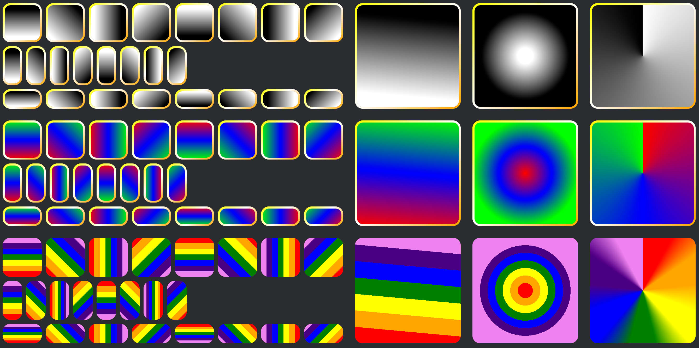

## Bevy UI Gradients

[](https://crates.io/crates/bevy-ui-gradients)
[](https://github.com/ickshonpe/bevy-ui-gradients)


## Basic usage

To draw a UI node with a gradient you insert the components `BackgroundGradient` and `BorderGradient`, which both newtype a vector of `Gradient`s. If you set a background color, the background color is drawn first and the gradient(s) are drawn on top.

The are three gradient structs corresponding to the three types of gradients supported: `LinearGradient`, `ConicGradient` and `RadialGradient`. These are then wrapped in a `Gradient` enum discriminator which has `Linear`, `Conic` and `Radial` variants. 

Each gradient type consists of the geometric properties for that gradient and a list of color stops.
Color stops consist of a color, a position or angle and an optional hint.  If no position is specified for a stop, it's evenly spaced between the previous and following stops. Color stop postions are absolute, if you specify a list of stops:

```
vec![        
    ColorStop::new(RED, Val::Percent(90.)), 
    ColorStop::new(Color::GREEN, Val::Percent(10.))
]
```

the colors will be reordered and the gradient will transition from green at 10% to red at 90%. 

Colors are interpolated between the stops in SRGB space. The hint is a normalized value that can be used to shift the mid-point where the colors are mixed 50-50.  between the stop with the hint and the following stop.

For sharp stops with no interpolated transition, place two stops at the same position.

`ConicGradient`s and `RadialGradient`s have a center which is set using the new `Position` type. `Position` consists of normalized (relative to the UI node) `Vec2` anchor point and a responsive x, y offset.


## Examples


```
cargo run --example gradients
```



```
cargo run --example radial_gradients
```

```
cargo run --example stacked_gradients
```

```
cargo run --example trivial
```
